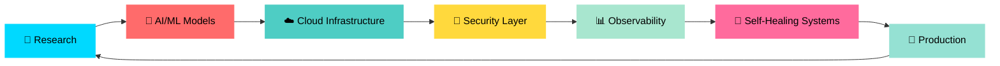

<div align="center">

# 🤖 Dr. Rahul Gaikwad


[](https://dr-rahulgaikwad.com/)
[](https://blogs.dr-rahulgaikwad.com/)
[](https://www.linkedin.com/in/dr-rahul-gaikwad/)
[](https://x.com/Dr_RahulGaikwad)
[](https://www.youtube.com/@Dr.RahulGaikwad)
[](https://medium.com/@dr-rahul-gaikwad)
[](https://sessionize.com/DrRahulGaikwad/)


</div>

---

<div align="center">

## 🚀 Tech Evangelist | AI/ML Innovator | Cloud Architect | Automation Wizard

</div>

```ascii
╔═══════════════════════════════════════════════════════════════════════════╗
║  🧠 Building Intelligent Systems That Think, Learn & Self-Heal            ║
║  ☁️  Architecting Cloud-Native Solutions at Scale                         ║
║  🔐 Securing the Future with Zero-Trust Architectures                     ║
║  ⚡ Automating Everything with Infrastructure as Code                     ║
╚═══════════════════════════════════════════════════════════════════════════╝
```

<div align="center">

### 💡 *"The best way to predict the future is to build it with AI"*

</div>

---

## 🎯 What I Do

<table>
<tr>
<td width="50%">

### 🤖 AI/ML Engineering
```python
def build_intelligent_systems():
    technologies = [
        "🧠 Deep Learning & Neural Networks",
        "🔮 Predictive Analytics & Forecasting", 
        "🎯 Computer Vision & NLP",
        "🤖 MLOps & Model Deployment",
        "📊 Data Engineering Pipelines"
    ]
    return "Transforming data into intelligence"
```

</td>
<td width="50%">

### ☁️ Cloud Architecture
```go
func DesignCloudSolutions() string {
    expertise := []string{
        "🏗️ Multi-Cloud Architecture (AWS/Azure/GCP)",
        "🐳 Kubernetes & Container Orchestration",
        "🔧 Infrastructure as Code (Terraform)",
        "🔄 CI/CD & GitOps Workflows",
        "📈 Auto-Scaling & High Availability"
    }
    return "Building resilient cloud ecosystems"
}
```

</td>
</tr>
<tr>
<td width="50%">

### 🔐 Security & Compliance
```bash
#!/bin/bash
implement_security() {
    echo "🛡️ Zero-Trust Architecture"
    echo "🔒 Secrets Management (Vault)"
    echo "🔍 Security Automation & Scanning"
    echo "📋 Compliance as Code"
    echo "🚨 Threat Detection & Response"
}
```

</td>
<td width="50%">

### 📊 AIOps & Observability
```javascript
const buildAIOps = () => {
  const capabilities = [
    "🔬 Self-Healing Infrastructure",
    "📡 Real-time Monitoring & Alerting",
    "🎯 Anomaly Detection with ML",
    "📊 Distributed Tracing",
    "🤖 Automated Incident Response"
  ];
  return "Intelligent operations at scale";
};
```

</td>
</tr>
</table>

---

## 🛠️ Tech Arsenal

<div align="center">

### 🧠 AI/ML & Data Science


### ☁️ Cloud & Infrastructure


### 🔧 DevOps & Automation


### 🔐 HashiCorp Stack


### 📊 Monitoring & Observability


### 💻 Languages


</div>

---

## 📊 GitHub Analytics

<div align="center">
  


</div>

---

## 🚀 Current Mission

<div align="center">



</div>

### 🎯 Active Projects

<table>
<tr>
<td width="33%">

#### 🤖 AIOps Platform
Building intelligent infrastructure that:
- 🔍 Detects anomalies in real-time
- 🔧 Auto-remediates issues
- 📊 Predicts failures before they happen
- 🎯 Reduces MTTR by 90%

**Stack:** Python, TensorFlow, K8s, AWS

</td>
<td width="33%">

#### 🔐 Zero-Trust Framework
Implementing next-gen security:
- 🛡️ Identity-based access control
- 🔒 Secrets automation with Vault
- 🔍 Continuous compliance scanning
- 🚨 Real-time threat detection

**Stack:** Vault, Consul, Terraform, Go

</td>
<td width="33%">

#### ☁️ Multi-Cloud IaC
Production-ready modules for:
- 🏗️ AWS, Azure, GCP deployments
- 🔄 GitOps workflows
- 📦 Reusable components
- 🎯 Best practices built-in

**Stack:** Terraform, HCL, GitHub Actions

</td>
</tr>
</table>

---

## 📝 Latest Content

<div align="center">

### 📚 Blog Posts | 🎥 Videos | 📰 Articles

</div>

<table>
<tr>
<td width="50%">

#### 🔥 Recent Blog Posts
- [Building Self-Healing Infrastructure with AI](https://blogs.dr-rahulgaikwad.com/self-healing-infrastructure)
- [Multi-Cloud Strategy: Best Practices 2026](https://blogs.dr-rahulgaikwad.com/multi-cloud-strategy)
- [AIOps: From Theory to Production](https://blogs.dr-rahulgaikwad.com/aiops-production)
- [Zero-Trust in Modern Cloud](https://blogs.dr-rahulgaikwad.com/zero-trust-cloud)

➡️ [Read more on my blog](https://blogs.dr-rahulgaikwad.com/)

</td>
<td width="50%">

#### 🎥 Video Content
- [AI-Powered DevOps Automation](https://www.youtube.com/playlist?list=PL3UvlUeO5Q-lJ3C27R0q8cKr8fGnTgjFp)
- [Terraform Best Practices](https://www.youtube.com/@Dr.RahulGaikwad)
- [Kubernetes Security Deep Dive](https://www.youtube.com/@Dr.RahulGaikwad)
- [HashiCorp Vault Masterclass](https://www.youtube.com/@Dr.RahulGaikwad)

➡️ [Subscribe on YouTube](https://www.youtube.com/@Dr.RahulGaikwad)

</td>
</tr>
</table>

---

## 🏆 Achievements & Impact

<div align="center">

| 🎓 Credentials | 📊 Impact | 🎤 Speaking |
|:---:|:---:|:---:|
| **Ph.D.** Computer Science | **50+** Organizations Helped | **20+** Conference Talks |
| **AWS Solutions Architect Pro** | **90%** MTTR Reduction | **10K+** Community Members |
| **Azure Solutions Architect** | **100+** Developers Mentored | **15+** Countries Reached |
| **CISSP Certified** | **1M+** Lines of IaC | **50+** Technical Workshops |
| **HashiCorp Certified** | **24/7** Autonomous Ops | **100+** Blog Posts |
| **CKA Kubernetes Admin** | **Zero-Downtime** Deployments | **5K+** YouTube Subscribers |

</div>

---

## 💼 Professional Journey

<div align="center">

### 🏢 Tech Evangelist & Solutions Architect @ [HashiCorp](https://www.hashicorp.com/)

</div>

```yaml
role: Tech Evangelist & Cloud Architect
focus_areas:
  - 🚀 Enterprise Cloud Transformation
  - 🏗️ Infrastructure Automation at Scale
  - 🔐 Security & Compliance Frameworks
  - 🎤 Developer Advocacy & Community Building
  - 📚 Technical Content Creation
  
impact:
  organizations_served: 50+
  developers_trained: 1000+
  conference_talks: 20+
  open_source_contributions: Active
  
specialization:
  - Terraform Enterprise Deployments
  - Vault Security Implementations
  - Multi-Cloud Architecture Design
  - AIOps & Self-Healing Systems
```

---

## 🌟 Featured Open Source

<div align="center">

<a href="https://github.com/dr-rahulgaikwad/aiops-self-healing">
  
</a>
<a href="https://github.com/dr-rahulgaikwad/terraform-modules">
  
</a>

<a href="https://github.com/dr-rahulgaikwad/security-automation">
  
</a>
<a href="https://github.com/dr-rahulgaikwad/kubernetes-patterns">
  
</a>

</div>

---

## 🎯 2026 Vision

<div align="center">

```diff
+ 📖 Publish "AIOps & Self-Healing Infrastructure" Book
+ 🎤 Speak at 10+ International Tech Conferences
+ 🌟 Contribute to 5 Major Open Source Projects
+ 👥 Mentor 100+ Developers in AI/ML & Cloud
+ 🏆 Build 10K+ Tech Community in Pune
+ 🎓 Launch "Cloud-Native Security" Online Course
+ 🚀 Release 3 Production-Ready Open Source Tools
```

</div>

---

## 🤝 Let's Build the Future Together

<div align="center">

### 💡 Open to Collaborate On

| 🤖 AI/ML Projects | ☁️ Cloud Architecture | 🔐 Security Solutions | 📚 Technical Content |
|:---:|:---:|:---:|:---:|
| Intelligent Systems | Multi-Cloud Design | Zero-Trust Frameworks | Blog Posts |
| MLOps Pipelines | Kubernetes Patterns | Secrets Management | Video Tutorials |
| AIOps Platforms | IaC Modules | Compliance Automation | Conference Talks |
| Predictive Analytics | GitOps Workflows | Threat Detection | Workshops |

</div>

---

## 📫 Connect With Me

<div align="center">

<a href="https://dr-rahulgaikwad.com/">
  
</a>
<a href="https://blogs.dr-rahulgaikwad.com/">
  
</a>
<a href="https://www.linkedin.com/in/dr-rahul-gaikwad/">
  
</a>
<a href="https://x.com/Dr_RahulGaikwad">
  
</a>
<a href="https://www.youtube.com/@Dr.RahulGaikwad">
  
</a>
<a href="https://medium.com/@dr-rahul-gaikwad">
  
</a>
<a href="https://sessionize.com/DrRahulGaikwad/">
  
</a>
<a href="https://github.com/dr-rahulgaikwad">
  
</a>

</div>

---

<div align="center">

## 💭 Random Dev Wisdom


---

### 🙏 Thanks for Visiting!


**If you find my work valuable:**
- ⭐ Star my repositories
- 🤝 Connect on [LinkedIn](https://www.linkedin.com/in/dr-rahul-gaikwad/)
- 📧 Reach out for collaborations
- 💬 Share feedback and ideas
- 🎥 Subscribe to my [YouTube](https://www.youtube.com/@Dr.RahulGaikwad)


---

<sub>💡 **"The best way to predict the future is to invent it with AI"** - Dr. Rahul Gaikwad</sub>


</div>
# dr-rahulgaikwad
